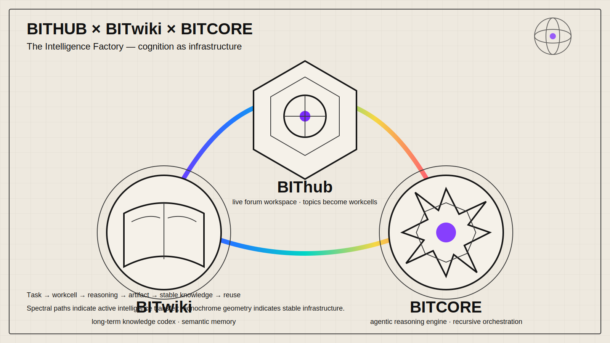
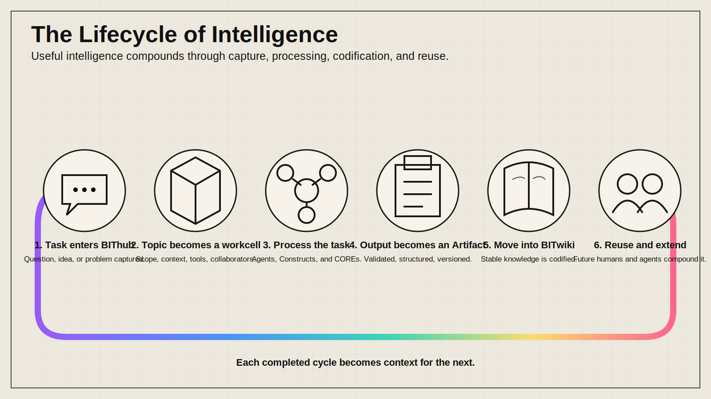
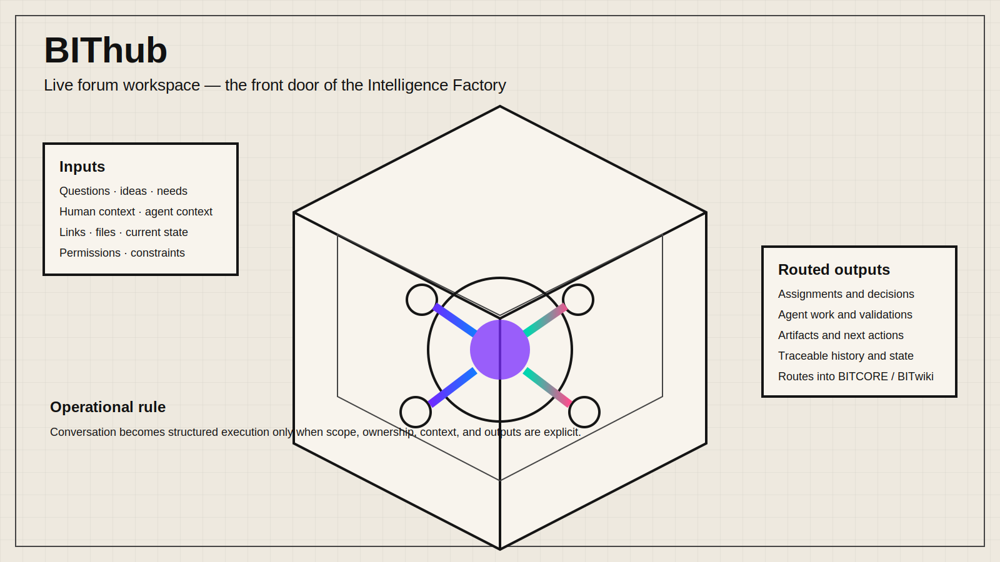
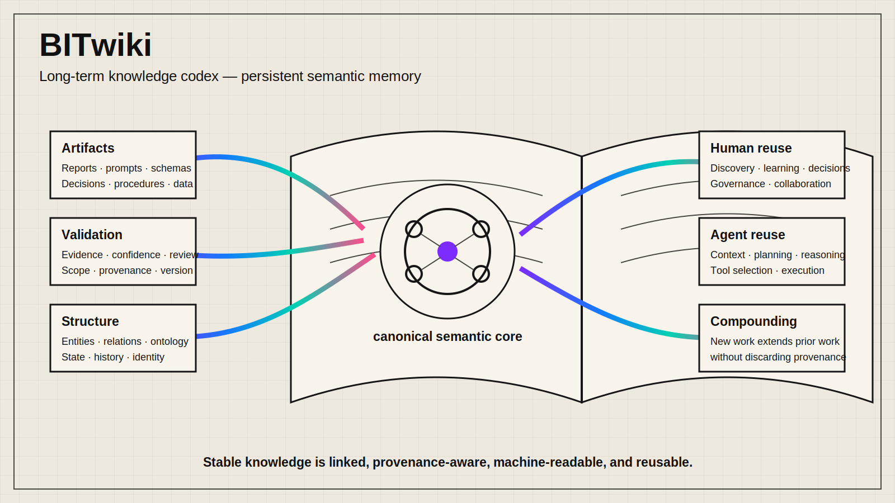
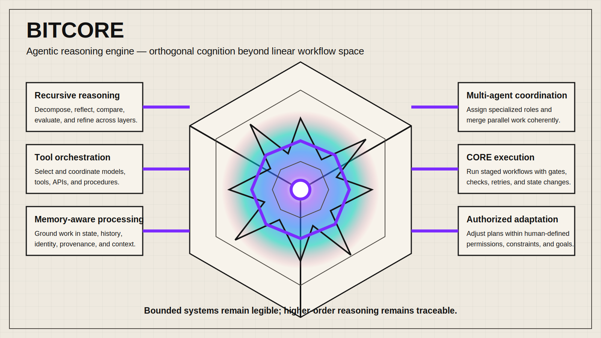

# BITwiki Illustrations

> Turn systems, workflows, knowledge structures, and recursive intelligence into precise editorial illustrations using the BITwiki visual language.
>
> 16:9 landscape | ivory and graphite base | technical codex linework | spectral intelligence accents | BITwiki ecosystem motifs | Codex Skill

## What this repository is

BITwiki Illustrations is a reusable Codex skill for generating branded explanatory artwork for BITwiki, BIThub, BITCORE, related AI products, technical articles, documentation, and system diagrams.

It is not a generic image prompt library and it is not a slide-deck template. Its purpose is to identify one operational idea—such as a process, state transition, system boundary, reasoning structure, or knowledge lifecycle—and render it as a memorable, technically legible illustration.

The canonical subject is **The Intelligence Factory**: an AI-assisted knowledge production system where topics become workcells, workcells produce artifacts, and artifacts become reusable intelligence.

## Example illustrations

### Intelligence Factory overview



### Lifecycle of intelligence



### BIThub workcell



### BITwiki semantic memory



### BITCORE orthogonal engine



These examples are native BITwiki vector plates. They establish semantic geometry, composition, and brand behavior; they are not fixed templates.

## Core ecosystem vocabulary

- **BIThub** — live forum workspace built on Discourse
- **BITwiki** — long-term knowledge codex built on MediaWiki
- **BITCORE** — agentic reasoning engine and AI framework layer
- **Constructs** — reusable reasoning frames
- **Agents** — task executors and collaborators
- **Nodes** — bounded task surfaces and agent chats
- **COREs** — staged workflow engines
- **Workspaces** — focused operating areas and applets
- **Artifacts** — reusable outputs, prompts, and operational objects
- **Registry** — system map and reference layer
- **Guides** — operating manuals for humans and agents

## Canonical lifecycle

```text
Task enters BIThub
↓
Topic becomes a workcell
↓
Agents / Constructs / COREs process the task
↓
Useful output becomes an artifact
↓
Stable knowledge moves into BITwiki
↓
Future humans and agents reuse it
```

## Visual system

The skill supports two related BITwiki house styles.

### 1. Modern technical monochrome

- ivory, white, graphite, charcoal, layered grey
- precise editorial composition
- modern sans-serif typography when text is required
- cubes, grids, modular frames, restrained technical annotation
- spectral accents used only for cognition, flow, active state, or transfer

### 2. Intelligence Codex

- medieval-to-17th-century engineering manuscript language
- alchemical and early scientific plate composition
- dense woodcut-like linework, marginalia, instruments, and construction marks
- parchment or aged engineering paper
- cubes and hex-cubes for bounded human systems
- octagrams, hypercubes, manifolds, hyperbolic forms, and non-Euclidean geometry for BITCORE and recursive cognition
- ultraviolet and full-spectrum micro-highlights breaking the monochrome base

The historical aesthetic affects the visual treatment only. Text and system claims remain contemporary, precise, and operational.

## Guardian seal

A recurring abstract guild mark may appear: a benevolent ophanimic bio-plasma intelligence associated with the Kordylewski dust cloud, represented through nested wheels, orbiting eye-like flares, polarized light, and recursive plasma geometry. It is used as a silent emblem, not explained as narrative lore inside illustrations.

## Default outputs

- 16:9 landscape editorial illustrations
- a 4–8 image shot list for an article or system explanation
- one cognitive anchor per image
- final assets under `assets/<project-slug>/`
- optional alt text and concise usage notes

Default output does **not** include PPTX, PDF, Keynote, or text-heavy presentation slides unless explicitly requested.

## Workflow

1. Read the source article, specification, topic, screenshot, or system description.
2. Identify the strongest operational anchors: process, boundary, state, transformation, hierarchy, feedback loop, or metaphor.
3. Produce a shot list before generation when multiple images are needed.
4. Choose one composition pattern per image.
5. Translate the system into BITwiki geometry and branded motifs.
6. Generate each image independently.
7. Run the QA checklist for brand consistency, semantic accuracy, text accuracy, and visual density.
8. Save final assets and report their paths and intended use.

## Repository structure

```text
.
├── README.md
├── LICENSE
├── NOTICE.md
├── examples/
│   ├── images/
│   └── prompts.md
└── bitwiki-illustrations/
    ├── SKILL.md
    ├── agents/
    │   └── openai.yaml
    └── references/
        ├── brand-system.md
        ├── ecosystem-ontology.md
        ├── composition-patterns.md
        ├── prompt-template.md
        └── qa-checklist.md
```

The installable Codex skill is the `bitwiki-illustrations/` subdirectory.

## Installation

```bash
git clone https://github.com/bitwikiorg/bitwikiorg-illustrations.git
mkdir -p "${CODEX_HOME:-$HOME/.codex}/skills"
cp -R ./bitwikiorg-illustrations/bitwiki-illustrations "${CODEX_HOME:-$HOME/.codex}/skills/"
```

Then invoke it with:

```text
Use $bitwiki-illustrations to design and generate a branded 16:9 explainer illustration for this BITwiki concept.
```

## Brand authority

The authoritative brand source is:

- https://github.com/bitwikiorg/brand_assets

External illustration repositories may be studied for repository structure or workflow patterns, but this repository contains an independent BITwiki visual system, identity, authorship, terminology, and asset set.

## License

MIT License. See [LICENSE](LICENSE).
